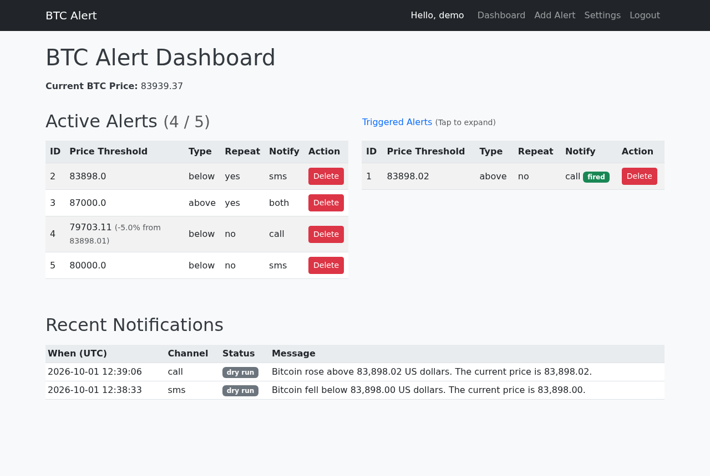
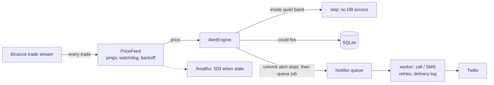
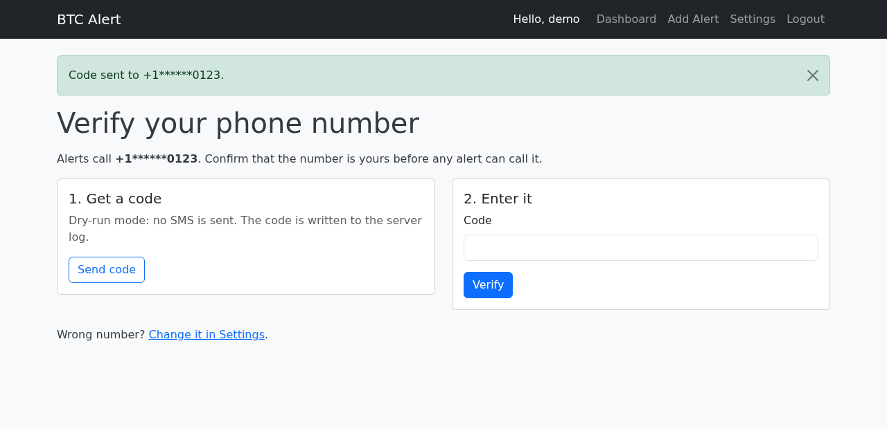

# 📈 Bitcoin Price Phone Alerts


[](https://github.com/Bogzx/Bitcoin-price-phone-alerts/actions/workflows/ci.yml)

A small self-hosted service that **phones you (or texts you) when Bitcoin crosses a
price you set**. It follows Binance's live trade stream, evaluates your alerts on every
trade, and places the call through Twilio. A price alert you can sleep through is not
much use; a phone call wakes you up.



## ⚡ Try it in two minutes (no Twilio account)

Dry-run mode logs every call, SMS and verification code instead of sending it:

```bash
git clone https://github.com/Bogzx/Bitcoin-price-phone-alerts.git
cd Bitcoin-price-phone-alerts
python -m venv venv && source venv/bin/activate
pip install -r requirements.txt
SECRET_KEY=dev NOTIFY_DRY_RUN=true SESSION_COOKIE_SECURE=false python app.py
```

Open <http://localhost:5000> and register. The first account is yours, and registration
closes after it. Then add an alert a few dollars from the live price and watch the
terminal for
`[dry-run] Would call +1******0123: Bitcoin rose above 83,970.01 US dollars. The current price is 83,970.01.`

With Docker:

```bash
docker build -t btc-alerts .
docker run -p 5000:5000 -v btc-alerts-data:/data \
  -e SECRET_KEY=change-me -e NOTIFY_DRY_RUN=true -e SESSION_COOKIE_SECURE=false btc-alerts
```

In the US, add `-e BINANCE_WS_URL=wss://stream.binance.us:9443/ws/btcusdt@trade`
(see [Binance endpoints](#binance-endpoints)).

## ✨ What it does

- **Alerts above or below a price**, or **a percent move** from the current price
  ("-5%"), converted to a threshold when you create it. The direction is picked from
  the live price, so you only type the number.
- **A phone call, an SMS, or both**, quoting the threshold and the price that crossed it.
- **Repeating alerts** that re-arm once the price has moved back out of the trigger zone
  by a hysteresis band, so chop around a level does not ring every few minutes.
- **Phone-number verification** with a one-time SMS code (Twilio Verify), required
  whenever registration is open to others.
- **Account settings**: change your number (it must be verified again), change your
  password, delete your account.
- **A delivery log** on the dashboard (sent, failed or dry run), live price and alert
  updates over Socket.IO, and `/healthz` for uptime monitoring.

## 🔍 How it works



1. **One feed, kept alive.** The socket pings every 20 s. A watchdog closes it after
   `FEED_STALE_SECONDS` without a trade, and reconnects back off exponentially, with
   jitter, from 1 s up to 60 s. `/healthz` returns 503 whenever there is no recent price,
   because a dead feed is the one failure that would otherwise be silent.
2. **Cheap ticks.** After each full evaluation the engine remembers the "quiet band", the
   price range in which no alert can fire or re-arm. Ticks inside it never touch the
   database. Any change to an alert or user ends the band, and alerts are re-read at
   least every `ALERT_FULL_SCAN_SECONDS` anyway.
   `python scripts/bench_ticks.py` reports about 2 ms → 0.02 ms per tick with 5 alerts,
   and 59 ms → 0.13 ms with 1,000.
3. **State first, phone second.** When an alert fires, its new state and a `queued`
   delivery-log row are committed before the job is queued. A background worker places
   the call or SMS with retries and records how it ended. If the app restarts in
   between, recent queued notifications are re-sent on startup, and channels that
   already went out are not repeated.
4. **One owner.** The feed runs in exactly one process. It holds a localhost port
   (`PRICE_FEED_LOCK_PORT`) as a lock, so a second gunicorn worker skips the feed instead
   of placing duplicate calls.

## 🛡️ Protecting your Twilio bill

Every alert is a call you pay for, to a number someone typed. The defaults are built
around that:

- **Registration closes after the first account** unless `ALLOW_REGISTRATION=true`.
- **Phone verification.** `REQUIRE_PHONE_VERIFICATION` is on by default whenever
  registration is open. Unverified users are sent to the verification page, cannot
  create alerts, and their alerts never fire. Users can request at most 3 codes per hour
  and get 5 guesses per code. Codes expire after 10 minutes.
- **Caps:** 5 active alerts per user, one notification per user per 5 minutes, and 50
  calls and SMS per rolling 24 hours for the whole deployment (a "both" alert counts as 2).
- **Phone numbers must be E.164**, with an optional country-code allowlist
  (`ALLOWED_PHONE_COUNTRY_CODES`): the cheapest brake on premium-rate abuse.
- **CSRF on every form**, secure `SameSite=Lax` cookies, rate limits on login,
  registration, settings and verification, and per-user Socket.IO rooms.
- **Phone numbers are masked in logs** (`+1******0123`).

Before exposing it to the internet, also set a **spend limit on the Twilio account**.
The in-app limits reduce the blast radius; only Twilio can bound it.



## 🚀 Running it for real

1. Copy `.env.example` to `.env` and fill it in (`.env` is gitignored: never commit it).
   You need `SECRET_KEY`, the Twilio `TWILIO_ACCOUNT_SID`, `TWILIO_AUTH_TOKEN` and
   `TWILIO_PHONE_NUMBER`, and, if others will register, `TWILIO_VERIFY_SERVICE_SID`
   (Twilio Console → Verify → Services → Create).
2. Start it with one worker:

   ```bash
   gunicorn --workers 1 --threads 50 -b 0.0.0.0:5000 app:app
   ```

   or use the Dockerfile, which does the same and adds a `HEALTHCHECK` on `/healthz`.
   Serve it over HTTPS. Over plain HTTP, set `SESSION_COOKIE_SECURE=false`, or the
   browser drops the session cookie.
3. Register your account **before** the app is reachable from the internet: whoever
   registers first on a fresh deployment owns it.
4. Point an uptime monitor at `GET /healthz`. It returns `200 {"status": "ok", ...}` while
   prices arrive and `503 {"status": "stale", ...}` otherwise.

## ⚙️ Configuration

All settings are environment variables (or `.env` lines).

| Variable | Description | Default |
|----------|-------------|---------|
| `SECRET_KEY` | Flask secret key. Without it every restart logs everyone out | none (required) |
| `DATABASE_URL` | SQLAlchemy URL | `sqlite:///alerts.db` (in `instance/`) |
| `TWILIO_ACCOUNT_SID` / `TWILIO_AUTH_TOKEN` | Twilio credentials | none (required unless dry run) |
| `TWILIO_PHONE_NUMBER` | The number calls and SMS come from | none (required unless dry run) |
| `NOTIFY_DRY_RUN` | Log calls, SMS and verification codes instead of sending them | `false` |
| `ALLOW_REGISTRATION` | Let anyone register. When `false`, only the first account can | `false` |
| `REQUIRE_PHONE_VERIFICATION` | Users must confirm their number with an SMS code | same as `ALLOW_REGISTRATION` |
| `TWILIO_VERIFY_SERVICE_SID` | Twilio Verify service that sends and checks the codes | none |
| `VERIFY_MAX_SENDS_PER_HOUR` / `VERIFY_MAX_ATTEMPTS` | Codes per user per hour / guesses per code | `3` / `5` |
| `VERIFY_CODE_TTL_SECONDS` | Lifetime of a dry-run code (Twilio Verify uses its own, 10 min by default) | `600` |
| `MAX_ACTIVE_ALERTS_PER_USER` | Cap on untriggered alerts per account | `5` |
| `NOTIFY_COOLDOWN_SECONDS` | Minimum seconds between two notifications for one user | `300` |
| `MAX_NOTIFICATIONS_PER_DAY` | Deployment-wide cap on calls+SMS per rolling 24 h; "both" counts 2 (0 = none) | `50` |
| `REPEAT_ALERT_COOLDOWN_SECONDS` | Minimum seconds before a repeating alert fires again | `900` |
| `REARM_HYSTERESIS_PERCENT` | How far (in % of the threshold) the price must retreat before a repeating alert re-arms | `0.25` |
| `ALLOWED_PHONE_COUNTRY_CODES` | Optional E.164 country-code allowlist, e.g. `1,44,40` | empty (any) |
| `BINANCE_WS_URL` | Binance trade stream URL | `wss://stream.binance.com:9443/ws/btcusdt@trade` |
| `FEED_STALE_SECONDS` | Seconds without a trade before the socket is recycled and `/healthz` reports stale | `60` |
| `FEED_RECONNECT_BASE_SECONDS` / `FEED_RECONNECT_MAX_SECONDS` | Reconnect backoff bounds | `1` / `60` |
| `ALERT_FULL_SCAN_SECONDS` | Longest time ticks may skip the database while no alert can fire | `5` |
| `RUN_PRICE_FEED` | Whether this process may run the Binance feed | `true` |
| `PRICE_FEED_LOCK_PORT` | Localhost port used as the feed lock. Keep it below the ephemeral range (32768+ on Linux) | `29653` |
| `SESSION_COOKIE_SECURE` | Send cookies over HTTPS only. Set `false` for local HTTP | `true` |
| `CORS_ALLOWED_ORIGINS` | Comma-separated Socket.IO origins | `http://localhost:5000,http://127.0.0.1:5000` |
| `LOGIN_RATE_LIMIT` | Flask-Limiter rule for login and settings changes | `10 per minute; 60 per hour` |
| `REGISTER_RATE_LIMIT` | Rule for `POST /register` | `5 per hour` |
| `VERIFY_SEND_RATE_LIMIT` / `VERIFY_CHECK_RATE_LIMIT` | Per-IP rules for sending and checking codes | `5 per hour` / `10 per minute` |
| `LOG_LEVEL` | Python log level | `INFO` |

### Binance endpoints

| Where you run it | `BINANCE_WS_URL` |
|---|---|
| Outside the US (default) | `wss://stream.binance.com:9443/ws/btcusdt@trade` |
| Outside the US, market-data-only mirror | `wss://data-stream.binance.vision/ws/btcusdt@trade` |
| United States | `wss://stream.binance.us:9443/ws/btcusdt@trade` |

`stream.binance.com` answers **HTTP 451** to US IP addresses, and `binance.us` answers
451 outside the US. The app logs a specific hint when it sees a 451 and keeps retrying
with backoff; `/healthz` stays 503 until prices arrive.

## 🧪 Development

```bash
pip install -r requirements-dev.txt
python -m pytest tests -q        # fake Twilio, fake Binance socket: no network, no calls
ruff check .
python scripts/bench_ticks.py    # per-tick cost with and without the quiet band
```

CI runs the tests on Python 3.10, 3.12 and 3.14. It refuses commits that track a venv,
a database or `.env`, and it builds and boots the Docker image.

```
Bitcoin-price-phone-alerts/
├── app.py                 # Entry point: loads .env, create_app(), starts the feed
├── btc_alerts/
│   ├── __init__.py        # create_app(): config, extensions, blueprints, services
│   ├── config.py          # Settings read from the environment
│   ├── models.py          # User, Alert, NotificationLog, PhoneVerification
│   ├── feed.py            # Binance socket, reconnect backoff, watchdog, feed lock
│   ├── engine.py          # Tick evaluation, quiet band, cooldowns, daily budget
│   ├── notifications.py   # Twilio calls/SMS, retrying worker, restart recovery
│   ├── verification.py    # One-time codes (Twilio Verify / dry run) and the gate
│   ├── services.py        # Wires feed -> engine -> notifier; starts the threads
│   ├── auth.py, alerts.py, settings.py   # Blueprints
│   ├── events.py          # Socket.IO connect handler (per-user rooms)
│   └── templates/, static/
├── scripts/bench_ticks.py
├── tests/
├── docs/                  # Screenshots
└── Dockerfile             # Single-worker gunicorn image with a /healthz HEALTHCHECK
```

Importing `btc_alerts` starts nothing. `create_app()` builds an app (the tests build one
per test), and only `app.py` starts the feed and the notification worker.

## ⚠️ Known limitations

- **Single process.** The current price and the Socket.IO state live in process memory,
  so run one worker (`gunicorn -w 1 --threads 50`, as the Dockerfile does). Use the
  threaded worker, not eventlet/gevent. Extra workers do not run the feed (the lock
  prevents duplicate calls), but they do not see live prices either. Multi-worker
  support would need a Redis message queue and a shared price cache.
- **No migration tool.** On SQLite, missing tables and columns are added at startup
  (additive only), so an `alerts.db` from an older version keeps working. On other
  databases, add new columns by hand or adopt Flask-Migrate.
- **BTC/USDT only**, from one exchange.

[CHANGELOG.md](CHANGELOG.md) lists what changed and why.

## 📄 License

MIT, see [LICENSE](LICENSE). Twilio calls and SMS are billed to your Twilio account.
